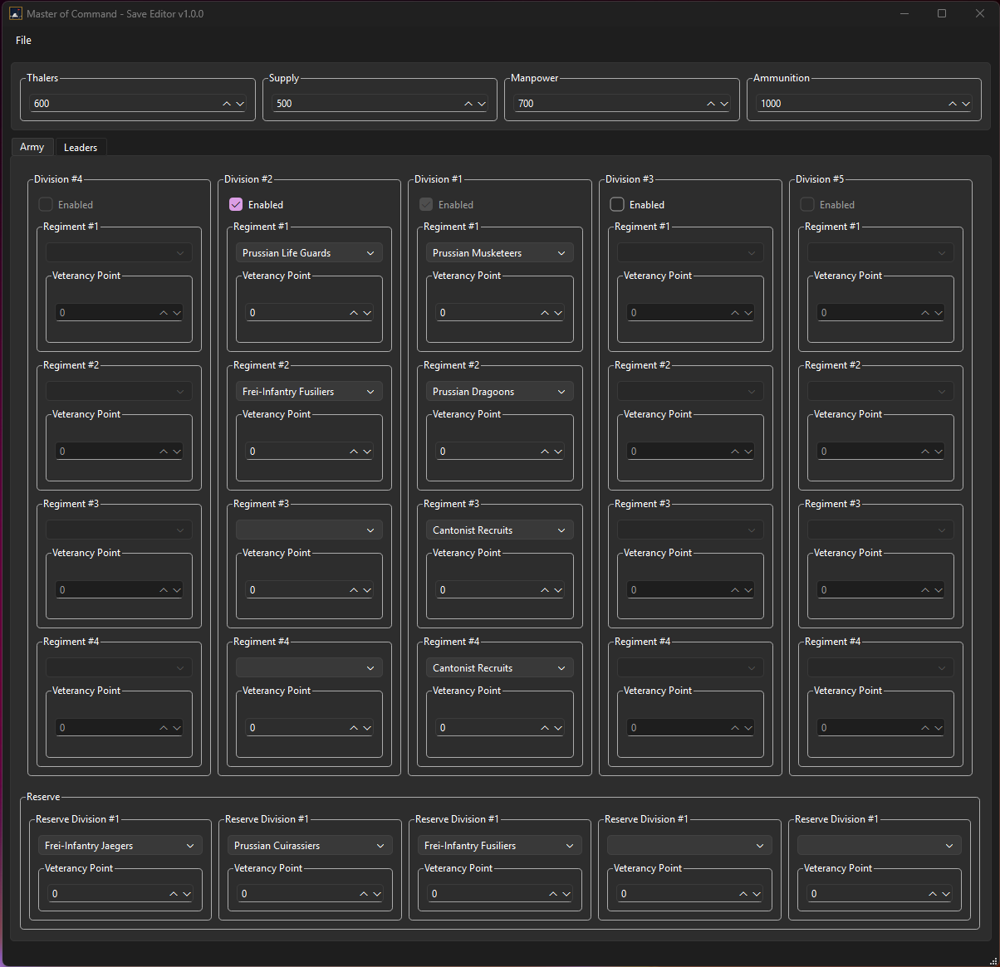

# Master of Command Save Editor

Save editor for **Master of Command** 

  

## Features
- Set player resources (cash, food, ammo, manpower).
- Army
  - Add/remove divisions
  - change regiment unit types
  - Adjust veterancy.
- Leaders
  - Create/delete officers
  - Edit levels/skill points
  - Modify skills

## Upcoming

Inventory editing still in progress!
Skill listing (shows modifiers attached)
Unit details (Make searching for certain units easier)

## Notes
- Backup your saves!
- The program requires access to the game files to populate unit types and correctly read stats, appearance data, and leader skill information.
- Save file location: `\AppData\LocalLow\Armchair Interactive\Master Of Command\Campaigns`
- Created leaders uses a custom template, change name and appearance on game instead
- Changing unit type will inherit old unit's inventory

